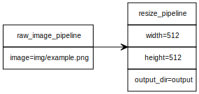

# Yumlabs

**Easily automate Python code using visual pipelines defined in yUML.**



Yumlabs is a growing collection of modular pipelines built using [Pypeyuml](https://github.com/codenergy-dev/pypeyuml), enabling you to automate complex Python workflows visually with [yUML](https://yuml.me/).

## ✨ Features

- 🧩 Plug-and-play pipeline modules for common automation tasks
- 🖼️ Image processing and generation workflows ready to use
- 🧠 Easy integration with AI tools like Stable Diffusion and ControlNet
- 💡 Custom pipeline support with minimal Python code
- 🔄 Supports multiple virtual environments for each pipeline — avoid dependency conflicts with full flexibility
- 📊 Visual representation of workflows using `.yuml` files

## 🔧 How It Works

1. Define your workflow steps using a `.yuml` following the [class diagram syntax](https://github.com/jaime-olivares/yuml-diagram/wiki#class-diagram).
2. Each block corresponds to a Python function stored in a `pipelines/*_pipeline.py` file.
3. Run the workflow via Pypeyuml, and it handles the execution chain automatically.

## 📦 Getting Started

```sh
git clone https://github.com/codenergy-dev/yumlabs.git

cd yumlabs

git clone https://github.com/codenergy-dev/pypeyuml.git

./setup/venv.sh

# Required for image_segmentation_pipeline and video_segmentation_pipeline
./setup/ben2.sh

# Required for image_restoration_pipeline
./setup/realesrgan.sh

# First create a yUML workflow
python3 ./pypeyuml/main.py ./yuml/resize_image.yuml ./pipelines
```

## 📁 Structure

```
yumlabs/
├── example/
│   └── example.yuml
├── pipelines/
│   ├── raw_image_pipeline.py
│   ├── resize_pipeline.py
│   └── ...
├── pypeyuml/
│   ├── main.py
│   └── ...
├── run_pipeline.py
└── README.md
```

## 🧪 Powered by

- [Pypeyuml](https://github.com/codenergy-dev/pypeyuml)
- [Python 3.10.16](https://www.python.org/downloads/)
- [yUML](https://yuml.me/)